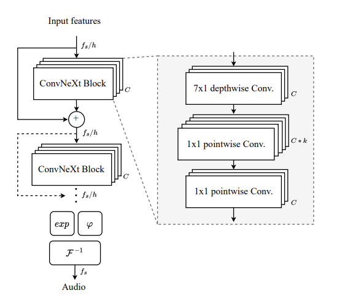

# Vocos: Closing the gap between time-domain and Fourier-based neural vocoders for high-quality audio synthesis

Unofficial PyTorch implementation of [Vocos](https://openreview.net/forum?id=vY9nzQmQBw) by Hubert Siuzdak.

Vocos is a fast neural vocoder designed to synthesize audio waveforms from acoustic features. Trained using a Generative Adversarial Network (GAN) objective, Vocos can generate waveforms in a single forward pass. Unlike other typical GAN-based vocoders, Vocos does not model audio samples in the time domain. Instead, it generates spectral coefficients, facilitating rapid audio reconstruction through inverse Fourier transform.

Audio samples and some information are provided in the [web](https://gemelo-ai.github.io/vocos/).

